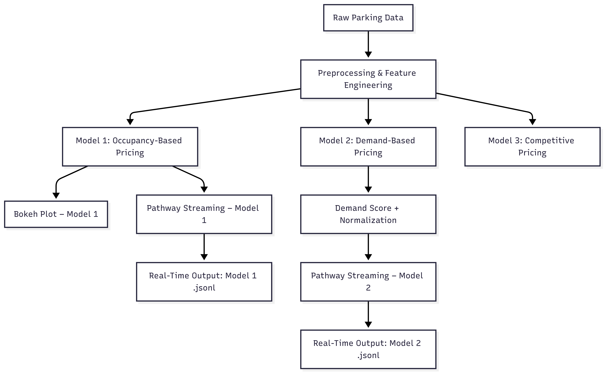

Smart Parking Dynamic Pricing – Summer Analytics Capstone

Name: Dikshita Sarma  
Email: dikshitasarma51@gmail.com  
Program: Summer Analytics 2025

Project Overview:

This project focuses on building a smart pricing system for parking lots that adjusts prices in real-time based on demand.  
Factors like occupancy levels, queue length, traffic, vehicle type, and special days were taken into account.

The idea is to explore different pricing models and simulate their behavior using real-time streaming.

Tech Stack Used:

- Python  
- Pandas, NumPy  
- Bokeh (for visualizations)  
- Pathway (for real-time stream simulation)  
- Google Colab (for execution)  
- GitHub (for version control and submission)

---

Architecture Diagram:
---------------------
The following diagram shows how different components of the project connect and work together.

*Diagram created using Mermaid Live Editor*

---

Project Workflow & Models:
--------------------------
1. **Raw Parking Data**  
   Started with a historical dataset containing details like occupancy, queue length, traffic level, timestamps, etc.

2. **Preprocessing**  
   Converted timestamps, cleaned the data, mapped categorical values, and calculated occupancy ratios.

3. **Model 1 – Occupancy-Based Pricing**  
   A simple formula was used: `Price = 10 + 2 × occupancy ratio`.  
   This model was visualized using Bokeh and also simulated using Pathway.

4. **Model 2 – Demand-Based Pricing**  
   Combined multiple features (traffic, vehicle type, queue, special day) to calculate a weighted demand score.  
   Normalized the score to compute dynamic pricing. This model was also streamed using Pathway.

5. **Model 3 – Competitive Pricing (Optional)**  
   Looked at nearby parking lots at the same time and adjusted pricing competitively.

6. **Real-Time Simulation**  
   Both Model 1 and 2 were run using a simulated real-time data stream (20-row dataset) with Pathway.  
   Output was saved as `.jsonl` files for review.

---

Repository Contents:
--------------------
- Dynamic_parking_pricing_capstone.ipynb – main code notebook  
- pathway_output.jsonl – Model 1 stream output  
- pathway_output_model2.jsonl – Model 2 stream output  
- architecture.png – architecture diagram  
- README.md – this file  
- Screenshots/ – 

---

How to Run:
-----------
- Open the notebook in Google Colab  
- Run all cells in sequence  
- Pathway logic streams the results into output files  
- Bokeh plots display the pricing behavior

---

Conclusion:
-----------
This capstone helped me understand and implement dynamic pricing models using real data.  
I learned how to build simulations that react to real-time demand and how to integrate streaming tools like Pathway into a real project.  
It gave me hands-on experience with pricing logic, visualization, and data workflows.

Thank you for reviewing my submission.

